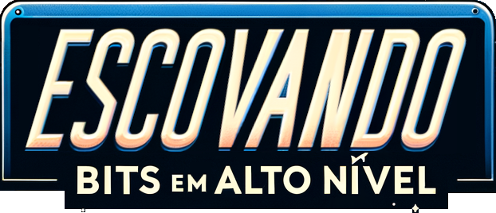

  

<!--  -->

> [!IMPORTANT]
> Não existe talento, existe prática e experiência. Na tecnologia onde tudo muda constantemente continuar exercitando o conhecimento e aprendendo coisas novas é fundamental. Comece pelas plataformas acima, todas disponíveis gratuitamente para aperfeiçoar nossas skills através de desafios de código em diversas linguagens.

> [!NOTE]
> Somos um grupo de profissionais de TI que acredita seriamente no Life Long Learning. Após atuarmos como voluntários para uma plataforma de tecnologia por alguns anos, resolvemos ampliar nossa atuação dando apoio aos estudantes nos estudos de todas elas e não apenas uma plataforma!

> [!TIP]
> Temos muitas ideias para dominar o mundo e tornar o mesmo um lugar melhor. Todos são bem-vindos!

> [!WARNING]
> Esse é um projeto novo ainda no início. A ideia é ajudar no aprendizado de estudantes de programação independente da stack escolhida. Quer colaborar? Entre no nosso discord acima, colabore com os nossos projetos ou abra uma issue no repositório desejado com suas sugestões!

> [!CAUTION]
> Programar é a escolha de quem não para! Conforme a tecnologia avança nós avançaremos junto, aprendendo e nos desenvolvendo mais a cada dia. Se você também ama tecnologia e tem consciência de que o estudo não vai acabar, estamos felizes com a sua chegada! 

  
  
     
     

  
<!-- # It's dangerous to go alone! 

  

 -->

<!--
**EBAN-Development/EBAN-Development** is a ✨ _special_ ✨ repository because its `README.md` (this file) appears on your GitHub profile.

Here are some ideas to get you started:

- 🔭 I’m currently working on ...
- 🌱 I’m currently learning ...
- 👯 I’m looking to collaborate on ...
- 🤔 I’m looking for help with ...
- 💬 Ask me about ...
- 📫 How to reach me: ...
- 😄 Pronouns: ...
- ⚡ Fun fact: ...
-->
